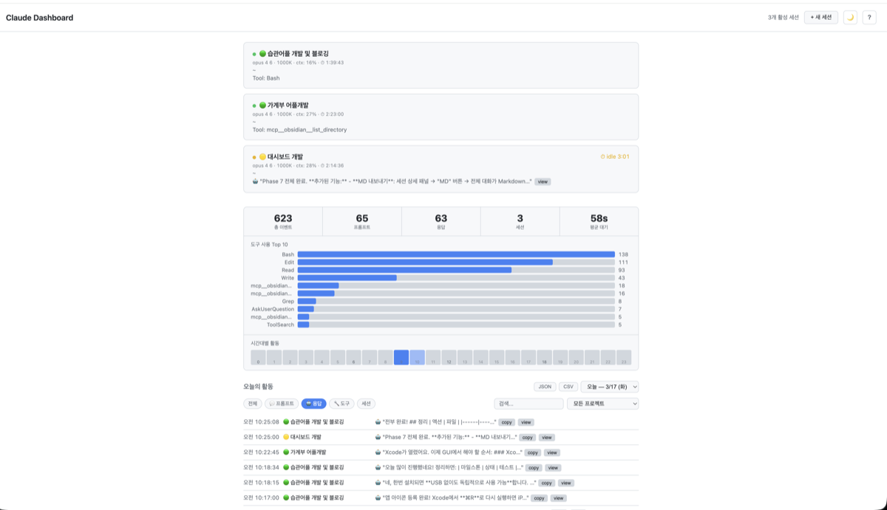
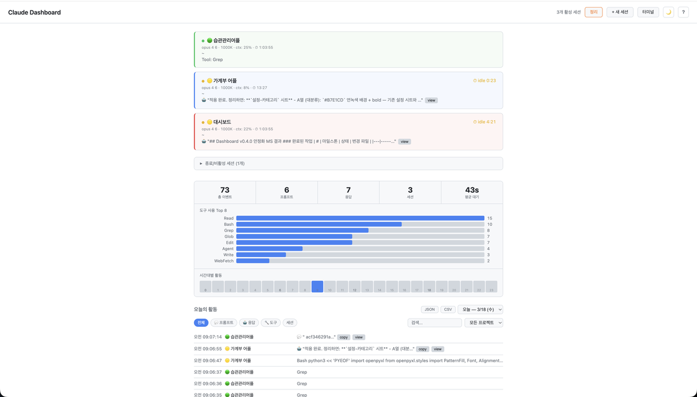
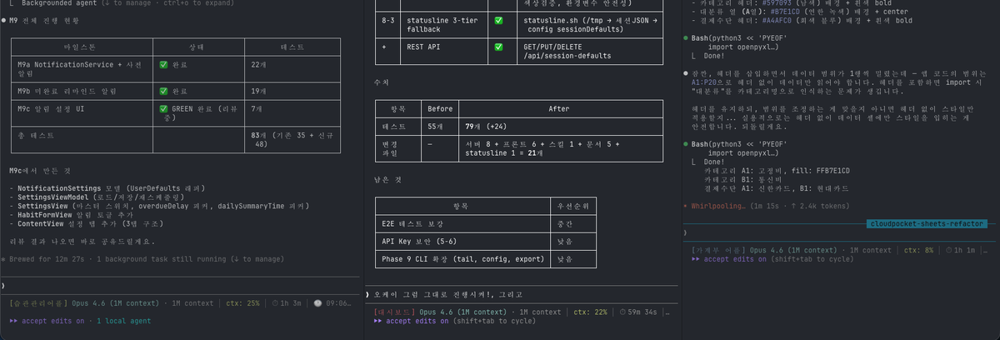
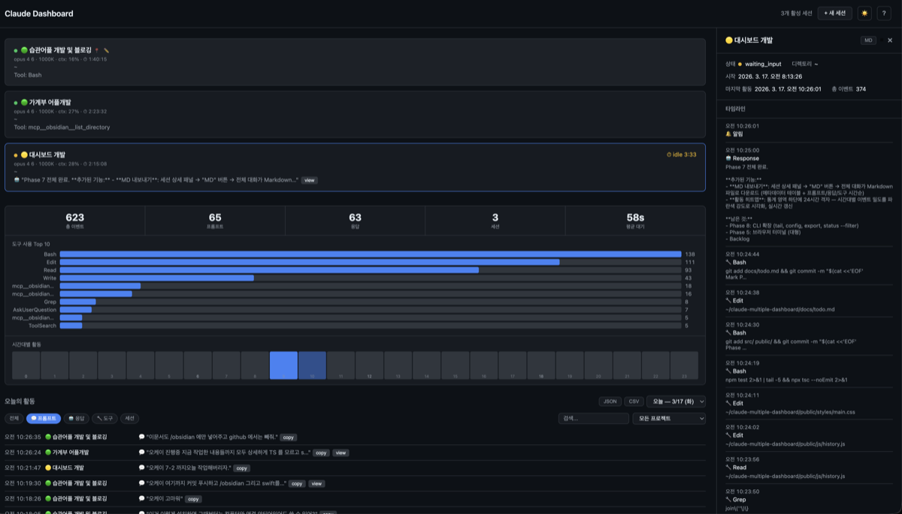
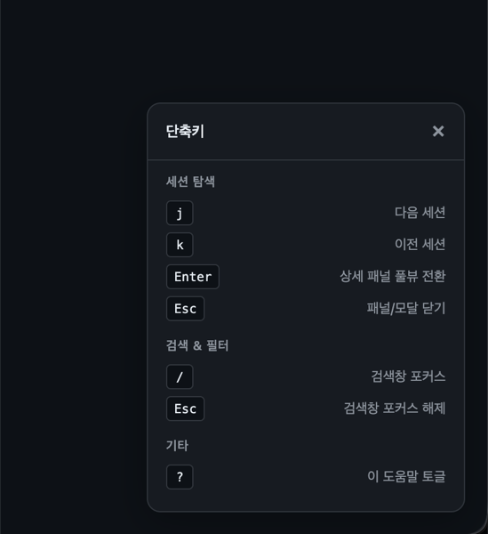

# Claude Multiple Dashboard

[한국어](README.ko.md) | **English**

A real-time web dashboard for monitoring **multiple Claude Code sessions** in parallel.



---

## Why?

When running 3-5 Claude Code sessions simultaneously across different projects:

- Hard to tell which session is **waiting for input**
- Sessions sit **idle for minutes** without notice
- No way to track **what each session has been doing**

This dashboard puts all sessions on one screen with real-time status, idle time tracking, and full activity history.

---

## Features

| Feature | Description |
|---------|-------------|
| **Real-time Monitoring** | 🟢 Active / 🟡 Waiting Input / 🟠 Waiting Permission / ⚪ Ended / 🔴 Disconnected |
| **Model & Context** | Model name, context usage (ctx: N%), elapsed time on each session card |
| **Idle Time Counter** | Live `⏱ idle MM:SS` from the moment a session starts waiting |
| **Prompt & Response** | View user prompts and Claude's last response directly on the dashboard |
| **Stats Dashboard** | Event/prompt/response counts + top 10 tool usage chart + hourly activity heatmap |
| **Project Grouping** | Sessions in the same directory are automatically grouped |
| **Session Pinning** | Pin important sessions to the top |
| **Dark/Light Theme** | Auto-detects system preference + manual toggle |
| **Keyboard Shortcuts** | j/k navigate, / search, Enter fullview, ? help |
| **Browser Terminal** | Run Claude Code directly in the dashboard via xterm.js + node-pty |
| **Terminal Grid** | View all PTY sessions simultaneously in a responsive grid |
| **Session Colors** | Color-coded session cards via `/session-setting` integration |
| **Data Export** | History as JSON/CSV + session transcript as Markdown |

### Session Colors & Multi-Session Monitoring



### Multiple Terminal Sessions



### Dark Mode + Detail Panel



### Keyboard Shortcuts



---

## Installation

### Prerequisites

- **Node.js** v20+
- **jq** (macOS: `brew install jq`)
- **Claude Code** CLI

### npm Global Install (Recommended)

```bash
npm install -g claude-multiple-dashboard
```

### Setup & Run

```bash
# 1. Initialize (register hooks + create data directory)
claude-dash init

# 2. Start server + open browser
claude-dash open

# 3. Use Claude Code as usual — sessions are monitored automatically
```

### Run from Source

```bash
git clone https://github.com/hey00507/claude-multiple-dashboard.git
cd claude-multiple-dashboard
npm install
npm run dash init
npm run dash open
```

---

## Update

```bash
# npm global install
npm update -g claude-multiple-dashboard

# From source
git pull && npm install && npm run build
```

---

## CLI Commands

| Command | Description |
|---------|-------------|
| `claude-dash init` | Register hooks and initialize data directory |
| `claude-dash start [-p port]` | Start dashboard server (default: 7420) |
| `claude-dash stop` | Stop dashboard server |
| `claude-dash status` | Check session status in terminal |
| `claude-dash open [-p port]` | Start server + open browser |
| `claude-dash clean` | Clean old logs (`--days N` or `--before YYYY-MM-DD`) |

---

## Session Presets & Colors

Name and color your sessions for quick identification. Colors are applied as tinted backgrounds on session cards.

### `/session-setting` Skill (Claude Code)

Copy the skill to your Claude Code commands directory:

```bash
cp commands/session-setting.md ~/.claude/commands/
```

Then use it in any Claude Code session:

```bash
/session-setting name:Dashboard color:red           # Current session only
/session-setting name:Dashboard color:red --save     # + Save as default for this project
/session-setting --list                              # List saved defaults
/session-setting --remove                            # Remove default for current directory
```

Supported colors: `red`, `green`, `yellow`, `blue`, `magenta`, `cyan`, `white`

**Project defaults** are saved in `~/.claude-dashboard/config.json` and automatically applied when a new session starts in the same directory.

---

## Architecture

```
Claude Code Sessions (A, B, C, ...)
    │  hook event (JSON stdin)
    ▼
dashboard-hook.sh (non-blocking, 1s timeout)
    │  curl POST
    ▼
Dashboard Server (Fastify 5)
    ├── REST API (session/log CRUD + stats)
    ├── SSE Stream (real-time updates)
    ├── WebSocket (/ws/terminal/:ptyId)
    ├── PTY Manager (node-pty)
    └── Static Files (web dashboard)
         │
         ├── sessions/*.json    (session metadata)
         ├── logs/YYYY-MM-DD/   (JSONL, auto .gz after 30 days)
         └── config.json
              │  SSE
              ▼
Web Dashboard (browser, Vanilla JS ES Modules)
```

- **Zero impact** on Claude Code even if server is down
- Data stored on **local filesystem** (no database required)
- Logs older than 30 days are **auto-compressed** to gzip

---

## Tech Stack

| Component | Technology |
|-----------|-----------|
| Runtime | Node.js v20+ |
| Language | TypeScript (strict) |
| Server | Fastify 5 |
| Frontend | Vanilla JS (ES Modules, no build tools) |
| Real-time | SSE + WebSocket (terminal) |
| Terminal | node-pty + xterm.js (CDN v5) |
| Storage | Local filesystem (JSON + JSONL + gzip) |
| Test | Vitest (79 tests) |
| CLI | Commander |

---

## Development

```bash
npm run dev          # Dev server (tsx watch mode)
npm test             # Run Vitest tests
npx tsc --noEmit     # Type check
npm run build        # TypeScript build
```

---

## Troubleshooting

See [docs/TROUBLESHOOTING.md](docs/TROUBLESHOOTING.md)

---

## License

MIT
